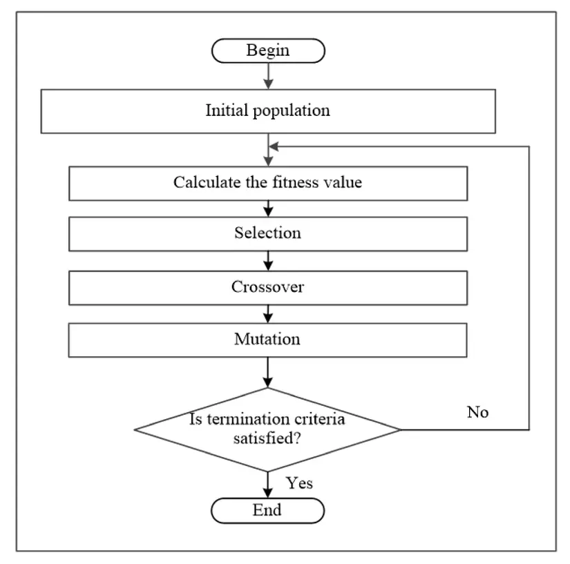
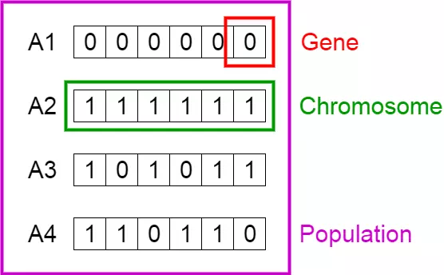
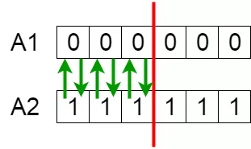
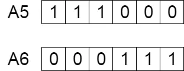

## Genetic Algorithm

**5 Phrase**
- Initial Population
- Fitness Score
- Selection
- Cross over
- Mutation

### Initial Population

- **Gene:**

- **Chromosome:** Nhiễm sắc thể là một solution cho bài toán, mỗi nhiễm sắc thể được biểu diễn bởi các gen
    > - Ở trên hình trên có thể coi giá trị ****1**** là thể hiện có, **0** là không có một đặc trưng tương ứng với vị trí của ô gen.

    > - Ví dụ ô gen ngoài cùng bên trái là đặc trưng chân dài, ô ngoài cùng bên phải là đặc trưng cổ dài.

- **Population:** Quần thể ban đầu khởi tạo là thế hệ 0, thế hệ này sau khi trải qua chọn lọc, trao đổi, đột biến sẽ tạo ra thế hệ 1, thế hệ 1 tạo ra thế hệ 2 và tiếp diễn như vậy.

### Fitness Score
Điểm phù hợp là căn cứ để chúng ta có thể chọn được các solution tốt để tạo ra thế hệ solution tiếp theo tốt hơn, những solution có điểm phù hợp cao hơn sẽ có xác suất được chọn lọc cao hơn. 

### Selection
- Quá trình chọn lọc trong giải thuật mô phỏng quá trình chọn lọc tự nhiên, những cá thể có điểm phù hợp cao nhất có xu hướng được lựa chọn để tạo ra thế hệ tiếp theo, nhưng **không nhất thiết phải chọn những cá thế phù hợp nhất.**

- Các cặp cá thể sẽ được lựa chọn làm bố và mẹ để tạo ra con cho thế hệ tiếp theo dựa trên điểm phù hợp của chúng.

### Cross-over
Với mỗi cặp cha mẹ, một cặp con ở thế hệ mới được tạo ra bằng cách đổi chỗ một đoạn nhiễm sắc thể giữa bố và mẹ.

> - Hai cá thể cha mẹ **A1 & A2** trao đổi 1 đoạn NST
> - Hai con **A5 & A6** được tạo ra từ A1 và A2

### Mutation
- Nếu chỉ có chọn lọc và trao đổi chéo một vài tính trạng của cá thể (solution) có thể sẽ không bao giờ được **activate**.

- Sự đột biến tạo ra sự đa dạng các solution, bằng cách thay đổi một số ít gen với xác suất nhỏ.